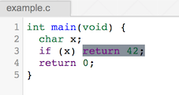
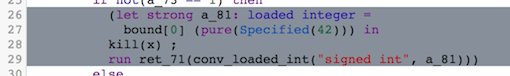
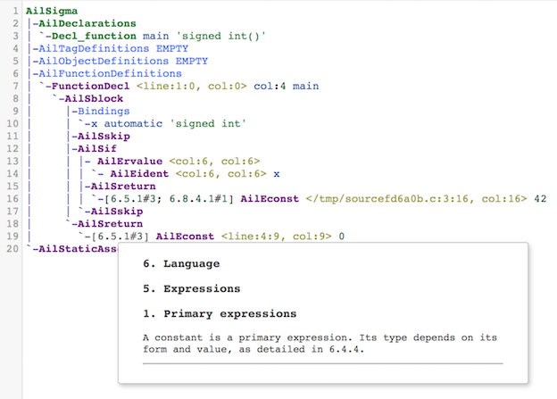
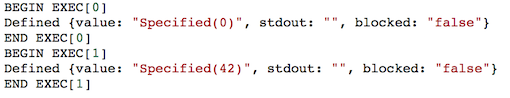

Cerberus
========

Cerberus is a tool for exploring the semantics of C the programming language.
C remains central to our computing infrastructure but still lacks a clear and
complete semantics. Programmers lack tools to explore the range of behaviours
they should expect; compiler development lacks test oracles; and formal
verification and analysis must make (explicitly or implicitly) many choices
about the specific C they target. The ISO standards for C have been developed
over many years but they remain unclear in some important respects, and in some
areas there are differences between the properties of C that are relied on by
the corpus of systems code in production, the properties that compiler
implementers aim to provide, and the properties of C as it is specified in ISO
C11.

The Cerberus project is developing a semantic model for a substantial fragment
of C. It has several distinctive features:

* Where the ISO C11 standard is clear and corresponds with practice, Cerberus
  aims to follow that.
* Where there are differences, chiefly in the *memory layout model* (the
  behaviour of pointers, pointer arithmetic, uninitialised values, etc.), we
  aim to clarify the de facto standards and understand how the ISO standard could
  be reconciled with them.
* Cerberus precisely defines a range of allowed behaviour, not just that of
  some specific implementation.
* It is executable, to explore all behaviours or single paths of small test
  programs.
* It is designed to be integrated with an operational model for C11
  concurrency, with a mechanised proof of equivalence to the axiomatic C11 model
  of Batty et al.
* Its thread-local semantics is factored via an elaboration into a simpler Core
  language, to make it readable and conceptually and mathematically tractable;
  the dynamic semantics of Core can be linked with our sequential memory layout
  model or with that operational concurrency model.
* Its front-end is written from scratch to closely follow the C11 standard,
  including a parser that follows the C11 standard grammar, and a typechecker.

This is a step towards a clear, consistent, and unambiguous semantics for C.

Getting Started
---------------

To use the web version:

### Loading a program

Load a test program, either by uploading a C file in `File > Load from file` or
by writing a test program directly. We also have a list of tests that
illustrate corner cases of the semantics, you can load these in `File > Load
defacto test`.

### Elaboration

Cerberus will immediately try to elaborate the code into Core, a functional
intermediate representation, and show it in a different tab.  Core is intended
to be as minimal as possible while remaining a suitable target for the
elaboration, and with the behaviour of Core programs made as explicit as
possible. For further information about Core, please check [Papers](#papers).

Every C expression is then highlighted with the corresponding Core code of the
same colour. Move the cursor on an expression to isolate the colour in that
particular expression.
The colouring behaviour can be changed in `Settings > Colour` and `Settings >
Coulour Cursor`.

In this little example, Cerberus binds a pure specified value `42` into the
label `a_81`, then kills the reference `x`, since it is going out of scope,
converts the value in `a_81` to a `signed int` and finally returns the
corresponding value.

The interface also allows you to see the abstract syntax tree of all the
Cerberus pipeline: Cabs (C Abstract) and Ail (Abstract Intermediate Language).
One can check them in `Elaborate > Cabs` and `Elaborate > Ail`.

Whenever possible, Ail and Core ASTs may contain _ISO C standard annotations_.
These justify the type-checking and elaboration. One can readily read the
relevant part of the standard by clicking on it.

### Execution

Cerberus is a executable semantics.  There are three execution mode in
Cerberus: `Random`, `Exhaustive` and `Interactive`.The latter is still in
development. In random mode Cerberus pseudorandomly explores a single allowed
execution path, while in exhaustive mode it performs an exhaustive search for
all allowed executions and can detect undefined behaviours on any allowed
execution path.

In our previous example, when running Cerberus in exhaustive mode, two outcomes
are possible: the conditional at line `3` is randomly evaluated to `true` or
`false`, since `x` is an `undefined value`.

### Compiling

Cerberus is integrated with Matt Godbolt's [Compiler
Explorer](https://godbolt.org). One can immediately check the compilation by
major compilers (Clang/GCC) to different targets (x86/ARM).

 Papers
------

* [Into the Depths of C: Elaborating the De Facto
Standards](http://www.cl.cam.ac.uk/~km569/into_the_depths_of_C.pdf). Kayvan
Memarian, Justus Matthiesen, James Lingard, Kyndylan Nienhuis, David Chisnall,
Robert N. M. Watson, and Peter Sewell. In Proc.
[37th ACM SIGPLAN Conference  on Programming Language Design and Implementation
(PLDI'16)](http://conf.researchr.org/home/pldi-2016). Distinguished paper award.

People
------

Contributors:

* Kayvan Memarian
* Justus Matthiesen
* Kyndylan Nienhuis
* Victor B. F. Gomes
* James Lingard
* David Chisnall
* Robert N. M. Watson
* Peter Sewell

The current main developers are Kayvan Memarian, Victor Gomes, and Kyndylan
Nienhuis. Cerberus originated with Justus Matthiesen's 2010-11 Part II project
dissertation and his 2011-12 MPhil dissertation; James Lingard's 2013-14 MPhil
dissertation developed a certifying translation validator for simple C programs
for the Clang front-end, w.r.t. the Cerberus and Vellvm semantics.

Funding
-------

This work is funded by [REMS: Rigorous Engineering of Mainstream
Systems](http://www.cl.cam.ac.uk/~pes20/rems), EPSRC Programme Grant
EP/K008528/1, EPSRC grant EP/H005633 (Leadership Fellowship, Sewell), and a
Gates Cambridge Scholarship (Nienhuis). This work is also part of the CTSRD
projects sponsored by the Defense Advanced Research Projects Agency (DARPA) and
the Air Force Research Laboratory (AFRL), under contract FA8750-10-C-0237. The
views, opinions, and/or findings contained in this paper are those of the
authors and should not be interpreted as representing the official views or
policies, either expressed or implied, of the Department of Defense or the U.S.
Government.
